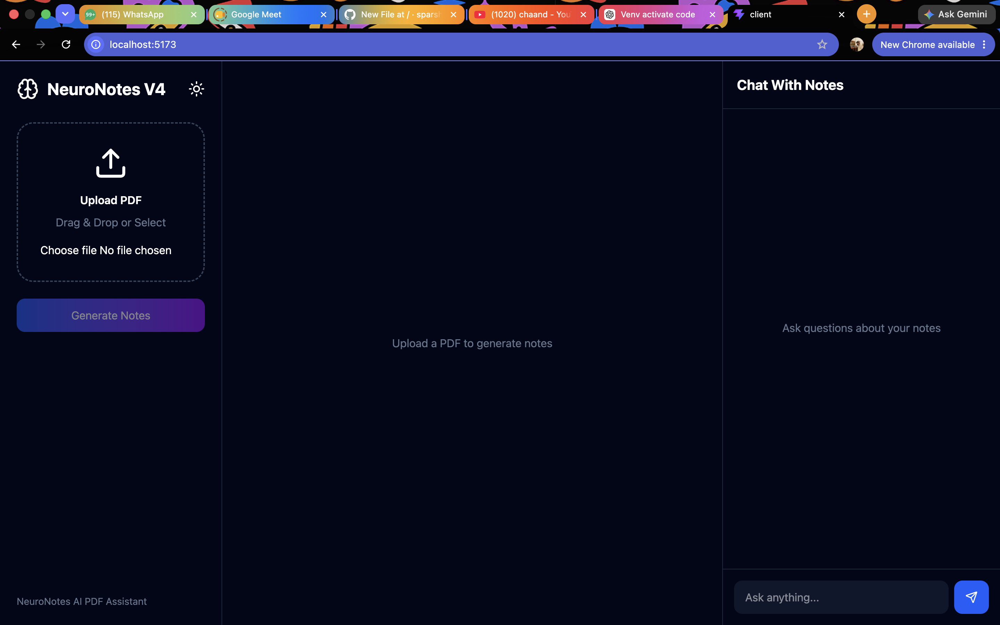
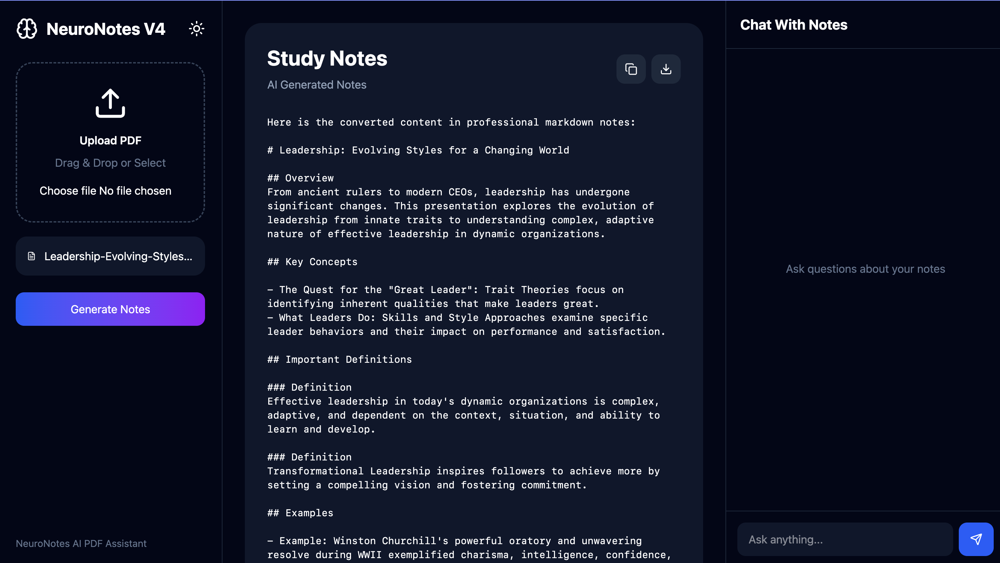

<h1 align="center">🧠 NeuroNotes </h1>

<p align="center">
  
</p>
<p align="center">
  
</p>

<p align="center">
  AI-Powered PDF Intelligence Platform built with React, FastAPI and Ollama
</p>

# 🧠 NeuroNotes

AI-powered PDF learning assistant built with React, FastAPI, and Ollama.

NeuroNotes helps students and professionals transform lengthy PDF documents into structured study notes and interact with those notes using an AI-powered chat interface.

---

## ✨ Features

### 📄 PDF Processing

* Upload PDF documents
* Automatic text extraction
* Large document chunking
* AI-generated study notes

### 🧠 Smart Notes Generation

* Key concepts extraction
* Structured summaries
* Important definitions
* Revision-ready notes

### 💬 Chat With Notes

* Ask questions about generated notes
* Context-aware responses
* Notes-based AI assistant

### 🎨 User Experience

* Modern dark-themed UI
* Drag & drop uploads
* Download generated notes
* Copy notes instantly
* Responsive interface

---

# 📁 Project Structure

```text
NeuroNotes/
│
├── client/
│   │
│   ├── src/
│   │   ├── App.jsx
│   │   ├── main.jsx
│   │   └── index.css
│   │
│   ├── public/
│   ├── node_modules/
│   ├── package.json
│   ├── package-lock.json
│   ├── vite.config.js
│   └── index.html
│
├── server/
│   │
│   ├── main.py
│   ├── venv/
│   ├── uploads/
│   └── generated_notes/
│
├── README.md
└── .gitignore
```

---

# 🚀 Tech Stack

## Frontend

* React.js
* Vite
* Axios
* React Markdown
* Lucide React
* Tailwind CSS

## Backend

* FastAPI
* PyPDF2
* Python Multipart
* Requests

## AI

* Ollama
* Llama 3

---

# ⚙️ Installation

## 1. Clone Repository

```bash
git clone https://github.com/your-username/NeuroNotes.git

cd NeuroNotes
```

---

# 🤖 Install Ollama

Download Ollama:

https://ollama.com

Pull Llama 3:

```bash
ollama pull llama3
```

Start Ollama:

```bash
ollama serve
```

Verify Installation:

```bash
ollama list
```

---

# 🖥 Backend Setup

Navigate to backend:

```bash
cd server
```

Create virtual environment:

```bash
python -m venv venv
```

Activate environment:

### Windows

```bash
venv\Scripts\activate
```

### macOS / Linux

```bash
source venv/bin/activate
```

Install dependencies:

```bash
pip install fastapi uvicorn pypdf2 python-multipart requests
```

Run backend:

```bash
uvicorn main:app --reload
```

Backend URL:

```text
http://127.0.0.1:8000
```

---

# 🌐 Frontend Setup

Open a new terminal:

```bash
cd client
```

Install dependencies:

```bash
npm install
```

Start development server:

```bash
npm run dev
```

Frontend URL:

```text
http://localhost:5173
```

---

# 🔌 API Endpoints

## Health Check

```http
GET /health
```

Response:

```json
{
  "status": "running",
  "ollama": true
}
```

---

## Upload PDF

```http
POST /upload-pdf/
```

Returns AI-generated study notes.

---

## Ask Question

```http
POST /ask-question/
```

Request:

```json
{
  "question": "Explain Neural Networks"
}
```

Response:

```json
{
  "answer": "Neural networks are..."
}
```

---

# 🧠 How It Works

### Step 1

Upload a PDF document.

### Step 2

FastAPI extracts text using PyPDF2.

### Step 3

The document is split into manageable chunks.

### Step 4

Each chunk is processed by Llama 3 through Ollama.

### Step 5

AI-generated notes are merged into a single structured output.

### Step 6

Generated notes are stored temporarily in memory.

### Step 7

Users can ask contextual questions using the built-in chat interface.

---

# 📸 Screenshots

## Home Screen

```md

```

## Generated Notes

```md

```

## Chat Interface

```md

```

---

# 🔮 Future Enhancements

* Flashcard Generation
* Quiz Generation
* OCR Support
* Multi-PDF Analysis
* RAG Pipeline
* Vector Database Integration
* User Authentication
* Cloud Deployment
* Export Notes as PDF

---

# ⚠️ Current Limitations

* Notes are stored in memory and reset on server restart.
* OCR support for scanned PDFs is not yet implemented.
* Processing time increases with very large PDFs.
* Optimized for local Ollama deployment.

---

# 👨‍💻 Author

**Sparsh Shreyash**

Built using React, FastAPI, Ollama and Llama 3.

---

# ⭐ Support

If you found this project useful:

* Star the repository
* Fork the project
* Open issues
* Submit pull requests

Happy Learning 🚀
